# 全球热门城市相似度分析

**说明：** 这个项目是 2018.07-08 参加新加坡国立大学（NUS）计算机学院（SoC）的暑研项目时做的。当时同组的有 4 名同学，我们一起花费了大概一周多的时间完成的，并且在最后的 presentation 环节拿到了 Topic 的 1st prize。我觉得这个项目挺有创意的，一直想整理一下 push 到 GitHub 上，但是事情比较多（太懒了）。2019.06 借两门课大作业的机会分别 redo 了一下项目的 主观游记文本 和 客观风景图片 部分，但是一直没有时间整理合并，直到又借这次大作业的机会将 redo 的两部分整理成一份文档。我 redo 的部分并没有包含当时我所做的 层次聚类算法，也没有主客观比较和算法比较部分，这些以后有时间会补充的。


## 摘 要

世界那么大，我想去看看。如今随着经济的发展，人们生活水平的日益提高，旅游已经逐渐从少数人的享受走进大众的生活，从畅游大江南北到领略世界风情，旅游休闲正逐渐成为人们的必需品，旅游消费也日益成为拉动经济增长的新动力[1]。

对于旅行目的地的选择，其中的参考因素有很多，比如他人旅行的体会、目的地的风景等等。本文从主观和客观两方面出发，以从谷歌图片[2]上爬取到的城市风景图片以及从马蜂窝上爬取到的旅行游记[3]为基础，使用 Girvan-Newman 算法对城市进行社团检测，探索其网络结构，并依据社团检测的可视化结果对全球热门城市的相似度进行分析。

本文研究的意义在于，可以利用社团检测结果作为一个推荐工具，根据游客自己的兴趣，告诉他接下来可以去哪个城市。

**关键词：** 城市相似度；马蜂窝游记；谷歌城市图片；社团检测；Girvan-Newman算法

## 目录

  * [第1章 绪论](#%E7%AC%AC1%E7%AB%A0-%E7%BB%AA%E8%AE%BA)
    * [1\.1 概览](#11-%E6%A6%82%E8%A7%88)
    * [1\.2 目的及意义](#12-%E7%9B%AE%E7%9A%84%E5%8F%8A%E6%84%8F%E4%B9%89)
    * [1\.3 环境与工具](#13-%E7%8E%AF%E5%A2%83%E4%B8%8E%E5%B7%A5%E5%85%B7)
  * [第2章 社团检测](#%E7%AC%AC2%E7%AB%A0-%E7%A4%BE%E5%9B%A2%E6%A3%80%E6%B5%8B)
    * [2\.1 社团检测的概念](#21-%E7%A4%BE%E5%9B%A2%E6%A3%80%E6%B5%8B%E7%9A%84%E6%A6%82%E5%BF%B5)
    * [2\.2 社团检测与聚类](#22-%E7%A4%BE%E5%9B%A2%E6%A3%80%E6%B5%8B%E4%B8%8E%E8%81%9A%E7%B1%BB)
  * [第3章 Girvan\-Newman 算法](#%E7%AC%AC3%E7%AB%A0-girvan-newman-%E7%AE%97%E6%B3%95)
    * [3\.1 Girvan\-Newman 算法原理](#31-girvan-newman-%E7%AE%97%E6%B3%95%E5%8E%9F%E7%90%86)
    * [3\.2 Girvan\-Newman 算法步骤](#32-girvan-newman-%E7%AE%97%E6%B3%95%E6%AD%A5%E9%AA%A4)
    * [3\.2 算法流程图](#32-%E7%AE%97%E6%B3%95%E6%B5%81%E7%A8%8B%E5%9B%BE)
  * [第4章 数据获取及处理](#%E7%AC%AC4%E7%AB%A0-%E6%95%B0%E6%8D%AE%E8%8E%B7%E5%8F%96%E5%8F%8A%E5%A4%84%E7%90%86)
    * [4\.1 谷歌城市图片](#41-%E8%B0%B7%E6%AD%8C%E5%9F%8E%E5%B8%82%E5%9B%BE%E7%89%87)
      * [4\.1\.1 数据的获取](#411-%E6%95%B0%E6%8D%AE%E7%9A%84%E8%8E%B7%E5%8F%96)
        * [4\.1\.1\.1 Google Images Download](#4111-google-images-download)
        * [4\.1\.1\.2 具体实现](#4112-%E5%85%B7%E4%BD%93%E5%AE%9E%E7%8E%B0)
      * [4\.1\.2 数据的处理](#412-%E6%95%B0%E6%8D%AE%E7%9A%84%E5%A4%84%E7%90%86)
        * [4\.1\.2\.1 Places365](#4121-places365)
        * [4\.1\.2\.2 具体实现](#4122-%E5%85%B7%E4%BD%93%E5%AE%9E%E7%8E%B0)
    * [4\.2马蜂窝游记](#42%E9%A9%AC%E8%9C%82%E7%AA%9D%E6%B8%B8%E8%AE%B0)
      * [4\.2\.1 数据的获取](#421-%E6%95%B0%E6%8D%AE%E7%9A%84%E8%8E%B7%E5%8F%96)
        * [4\.2\.1\.1 爬虫框架Scrapy](#4211-%E7%88%AC%E8%99%AB%E6%A1%86%E6%9E%B6scrapy)
        * [4\.2\.1\.2 具体实现](#4212-%E5%85%B7%E4%BD%93%E5%AE%9E%E7%8E%B0)
      * [4\.2\.2 数据的处理](#422-%E6%95%B0%E6%8D%AE%E7%9A%84%E5%A4%84%E7%90%86)
        * [4\.2\.2\.1 相关方法](#4221-%E7%9B%B8%E5%85%B3%E6%96%B9%E6%B3%95)
          * [4\.2\.2\.1\.1 结巴（jieba）](#42211-%E7%BB%93%E5%B7%B4jieba)
          * [4\.2\.2\.1\.2 TF\-IDF](#42212-tf-idf)
          * [4\.2\.2\.1\.3 余弦相似度](#42213-%E4%BD%99%E5%BC%A6%E7%9B%B8%E4%BC%BC%E5%BA%A6)
      * [4\.2\.2\.2 具体实现](#4222-%E5%85%B7%E4%BD%93%E5%AE%9E%E7%8E%B0)
  * [第5章 可视化分析](#%E7%AC%AC5%E7%AB%A0-%E5%8F%AF%E8%A7%86%E5%8C%96%E5%88%86%E6%9E%90)
    * [5\.1 基于风景图片的社团检测](#51-%E5%9F%BA%E4%BA%8E%E9%A3%8E%E6%99%AF%E5%9B%BE%E7%89%87%E7%9A%84%E7%A4%BE%E5%9B%A2%E6%A3%80%E6%B5%8B)
    * [5\.2 基于游记文本的社团检测](#52-%E5%9F%BA%E4%BA%8E%E6%B8%B8%E8%AE%B0%E6%96%87%E6%9C%AC%E7%9A%84%E7%A4%BE%E5%9B%A2%E6%A3%80%E6%B5%8B)
  * [第6章 结论与展望](#%E7%AC%AC6%E7%AB%A0-%E7%BB%93%E8%AE%BA%E4%B8%8E%E5%B1%95%E6%9C%9B)
    * [6\.1 结论](#61-%E7%BB%93%E8%AE%BA)
    * [6\.2 不足之处及未来展望](#62-%E4%B8%8D%E8%B6%B3%E4%B9%8B%E5%A4%84%E5%8F%8A%E6%9C%AA%E6%9D%A5%E5%B1%95%E6%9C%9B)
  * [参考文献](#%E5%8F%82%E8%80%83%E6%96%87%E7%8C%AE)

## 第1章 绪论

### 1.1 概览

本文的研究内容是基于旅行游记及城市风景图片对全球热门城市相似度的分析。具体研究流程如下：首先根据马蜂窝的热门城市排名，挑选 50 个具有代表性的城市。对于客观图片数据，先从谷歌图片中，以“城市名称 + scenery”为关键字，对这 50 个城市每个爬取 50 张图片。之后人工对每个城市手动选择 30 张高质量的图片来代表这个城市。再使用 Places365 模型获取图片的场景语义信息。识别完成后将每个城市作为一个字典并归一化字典权重，然后计算相似矩阵。对于主观游记数据，使用 Scrapy 从马蜂窝服务器中对这 50 个城市每个爬取 75 篇游记。之后将每个城市的所有游记用 jieba 进行分词并去除停止词，完成后以城市为单位记录清洗结果。再对清洗后的城市游记计算 TF-IDF 矩阵并归一化。再根据 TF-IDF 矩阵把每个城市表示为一个向量，以余弦相似度作为城市游记文本相似度度量标准，计算相似矩阵。基于两个相似矩阵分别建立城市关系网络，并对城市网络使用 Grivan Newman 算法进行社团检测，最后对结果进行可视化对比分析。

### 1.2 目的及意义

旅行目的地的选择是令很多人纠结的问题，本文的研究以多数人选择目的地的重要参考因素——体会、风景，作为切入点对全球热门城市的相似度进行分析。对于社团检测的结果可以利用其作为一个推荐工具，比如一个人喜欢某一个城市，但是去这个城市的成本过高或者有其它原因无法到达，那么可以基于社团检测的结果，推荐给他一些和这个城市处在同一社团的相似城市，并可以按相似度进行一个排序供其选择。或者说某一个人喜欢拥有某些关键词的城市，那么可以依据城市向量，将符合这些条件的城市社团推荐给他。这样游客根据自己的兴趣，可以有效的缩小目的地范围甚至锁定想要去的目标城市。

### 1.3 环境与工具

>   处理语言：Python、Bat

>   系统环境：Windows 10

>   使用工具：Google Images Download、

>   &emsp; &emsp; &emsp; &emsp; Places365、

>   &emsp; &emsp; &emsp; &emsp; Gephi

## 第2章 社团检测

### 2.1 社团检测的概念

社团检测通常是指将网络中联系紧密的部分找出来，而这些部分就称之为社团[4]。社团内部联系稠密，而社团之间联系稀疏[5]。社团是复杂网络重要的结构特征之一，其往往对应于网络的基本功能单元。因此，通过检测社团结构，可能揭示网络的结构与功能之间的关联关系。此外，已有研究表明，复杂网络在社团层面上通常会显现出单个顶点或整个网络层面所不具备的一些特性[6]，因此，通过对网络社团结构的研究可能捕捉到复杂网络的更多有意义的特性。

### 2.2 社团检测与聚类

聚类讨论的是如何划分数据，使得相似的数据聚到一起。数据通常用一维向量表示，而其对相似的判断一般直接使用数据的特征构成的向量来计算的，不考虑数据网络的边或者度。也就是说，聚类侧重于找到一堆属性相似的目标，从而忽略了目标与目标之间的联系。而社团检测侧重于找到网络中联系紧密的部分，而经常忽略节点的属性[7]。但是，两者又并不完全独立，更准确地说是两者只是考虑的角度不同。社团检测算法也可以视为一种广义的聚类算法，很多聚类方法稍加变通就可以用于社团检测。比如说就社团检测的邻接矩阵而言，将每个行看作一个属性，每个列看作目标，就可以直接将其转为聚类，用聚类的方法求解。

## 第3章 Girvan-Newman 算法

### 3.1 Girvan-Newman 算法原理

社团检测总体而言可以分为分裂法(自顶向下)和凝聚法(自底向上)。Girvan和Newman于2002年提出的分裂算法已经成为探索网络社团结构的一种经典算法,简称 GN 算法[5]。由网络中社团的定义可知，所谓社团就是指其内部顶点的连接稠密，而与其他社团内的顶点连接稀疏。这就意味着社团与社团之间联系的通道比较少，一个社团到另一个社团至少要通过这些通道中的一条。如果能找到这些重要的通道，并将它们移除，那么网络就自然而然地分出了社团。Girvan 和 Newman 提出用边介数(betweenness)（2002）来标记每条边对网络连通性的影响。某条边的边介数是指网络中通过这条边的最短路径的数目。两顶点间的最短路径在无权网中为连接该顶点对的边数最少的路径。由此定义可知，通过社区内部的边的最短路径相对较少，边介数比较小。而通过社区之间的边的最短路径的数目则相对较多，边介数比较大，因为社团间顶点对的最短路径必然通过它们[8]。下图a, b分别是边的强度以及边介数在现实网络中的分布情况[9]。

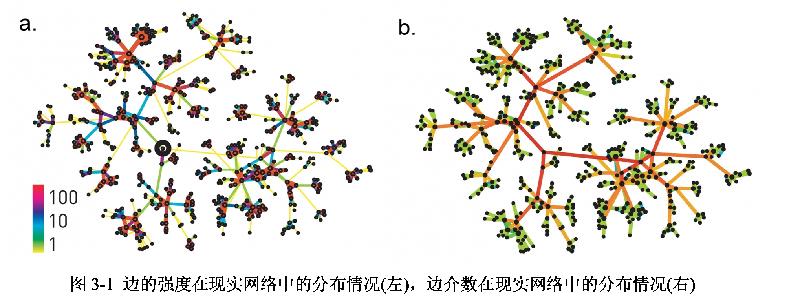

### 3.2 Girvan-Newman 算法步骤

GN 算法的基本流程如下：首先计算网络中每条边的边介数。然后找出边介数最大的边，并将它移除。最后不断重复上述两步，直到网络中所有的边都被移除。

GN 算法伪代码：


下图是 GN 算法的简单易懂的例子（图片来源于网络），每次断去边介数最大的边，不断重复直到网络中的任一顶点作为一个社区，即可得到社团检测结果。

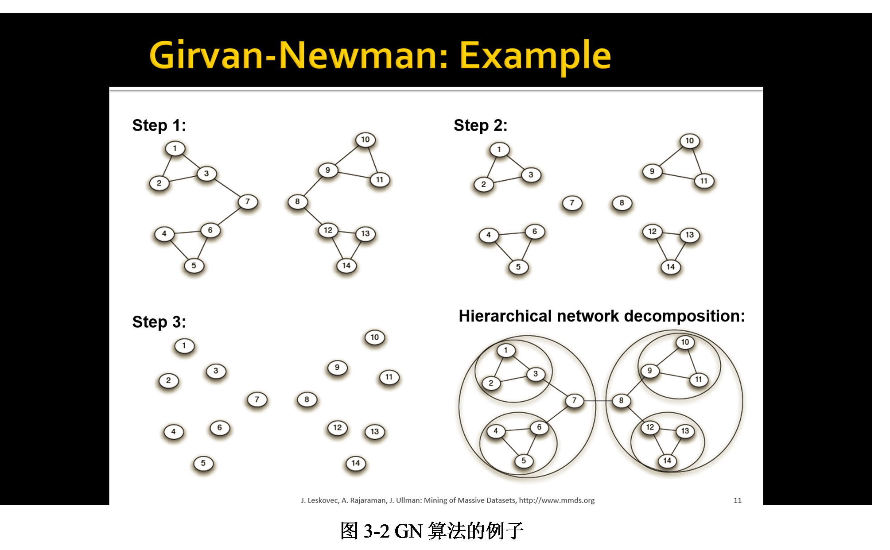

### 3.2 算法流程图

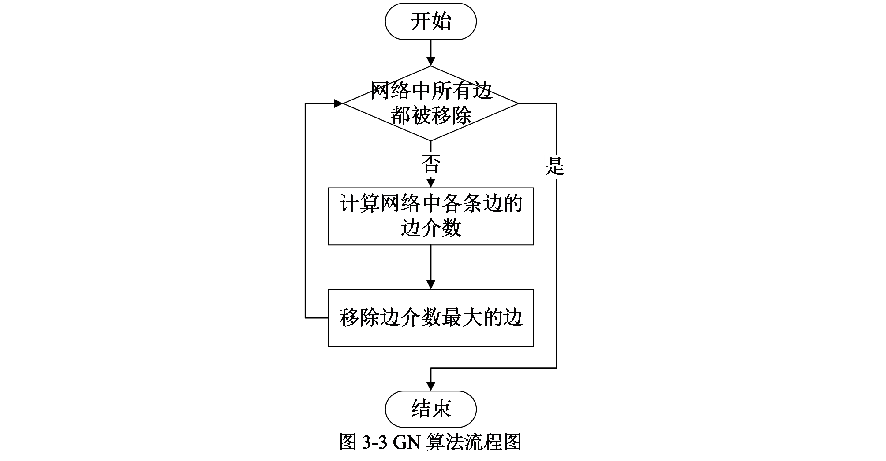

## 第4章 数据获取及处理

### 4.1 谷歌城市图片

#### 4.1.1 数据的获取

##### 4.1.1.1 Google Images Download

[google_images_download](https://github.com/hardikvasa/google-images-download) 是一个开源在 GitHub 上的用于搜索并下载数以百计的谷歌图像的 Python 脚本[10]。它主要用于教育用途。下图是其 GitHub 主页。


这个脚本可以使用命令对 Google 图片搜索关键字或词，进行有选择的下载。也可以借助 python 的文件脚本来进行图片搜索。对于命令下载，进入到下载目录即可使用如下命令进行下载。

```bash
googleimagesdownload -k “关键字或词” -l 下载图片数量
```

参数 -k 指的是关键词（Keyword），关键词需要用半角直双引号框住。参数 -l 指的是限制（limit），其后指定下载图片的数量。由于本文研究仅使用到这两个参数，所以虽 google_images_download 还有很多可用参数，但在此不一一赘述。

##### 4.1.1.2 具体实现

根据马蜂窝的热门城市热度排名，挑选 50 个各具特色的且非常具有代表性的城市。然后使用 Windows 批处理脚本复数次运行上述命令，关键词使用城市英文名称加上 scenery，下载数量设置为 50。由于是搜索下载，难免会产生图不对文或者搜索图片代表性不高的现象，所以在全部城市的图片下载完成后，人工的对每个城市手动选择 30 张高质量的图片来代表这个城市。批处理的将每个城市的所有图片从 1 到 30 重命名。每个城市一个文件夹，每个文件夹中 30 张图片。这就是每个城市的原始数据，之后是对原始数据的预处理部分。

#### 4.1.2 数据的处理

##### 4.1.2.1 Places365

Places365 是 Places2 数据库的最新子集。Places365 有两个版本：Places365-standard 和 Places365-challenge。Places365-Standard 的训练集包含 365 个场景类别的约 180 万幅图像，其中每个类别最多有 5000 幅图像。Places365-Challenge 的训练集合中，包含了额外的 620 万张图片，以及 Places365-Standard 的所有图片(共约800万张图片)，其中每个类别最多有 40,000 张图片。在 Places365-Standard 上有很多经预先训练的 CNN 模型[11]。本文的研究使用的是其已经开源发布的 Places365-Standard 中的 ResNet50 模型。其在测试集上有 80% 以上的准确率。

将图片输入进 Places365-CNN 模型可以获得图片的场景语义信息以及相应的相似性评分，评分越高说明图片和这一场景的相似度越高。其
demo 如下所示，对于输入的图片可以看到其给出了摩天大楼(skyscraper)和市中心(downtown)的语义信息，并且摩天大楼的评分高些。

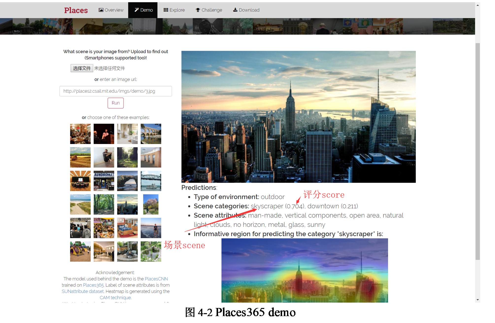

##### 4.1.2.2 具体实现

对于原始数据(图片)来说，不能直接计算其相似度，一是图片的信息量过大容易过拟合，二是这样计算出来的相似度过低社团检测效果不好。本文的研究采用以城市风景图片的场景语义信息作为城市关键词，将关键词之间的相似度作为城市之间相似度的度量方法。实际实现是对于每个城市的所有图片使用 Places365 识别图片场景语义及评分。下图分别使用 Places365 识别出的夏威夷（左）的语义信息及评分，和纽约（右）的语义信息及评分。其中语义信息是城市的所有图片的语义信息的集合，评分则是所有图片的相同语义信息的评分之和。

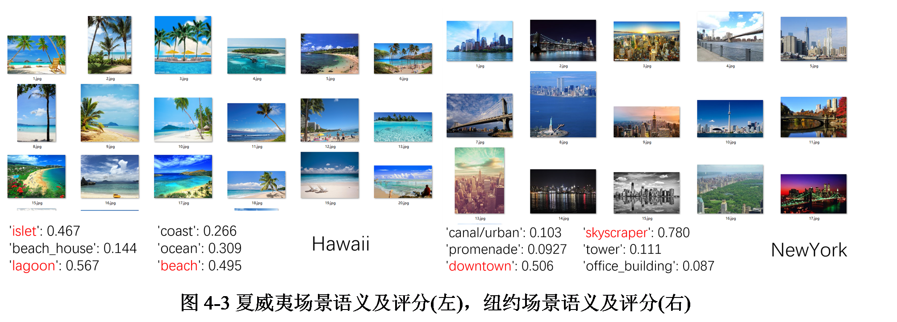

得到每个城市的语义信息和评分后，将每个城市作为一个字典，其中语义信息作为关键词，评分作为权重，并把字典的中每个关键词的所有权重归一化，然后计算相似矩阵。相似矩阵中计算相似度的具体方法是：对于任意的两个城市，将两个城市中所有相同关键词的权重相乘，然后将这所有的乘积值相加，而加和的结果就作为这两个城市之间的相似度。这样计算出来的相似矩阵的每个相似度值一定是在 0 到 1 之间的，因为字典的权重值是归一化的。

需要说明的是：由于是大数据，所以每两个城市字典或多或少都会有一些相似性，这就导致几乎每个城市都会和其他城市相连接，因此本文的研究使用阈值去除掉一些相似度较小的边。而阈值的选取由人工多次实验观察社团检测效果得到。

一般来说，相似度越大说明城市之间的距离越小，本文的研究把一减相似度作为距离得到距离矩阵，并以此建立城市关系网络。对城市网络使用 Grivan Newman 算法进行社团检测，并对结果进行可视化分析。

### 4.2马蜂窝游记

#### 4.2.1 数据的获取

##### 4.2.1.1 爬虫框架Scrapy

Scrapy 是一个为了爬取网站数据，提取结构性数据而编写的应用框架。可以应用在包括数据挖掘，信息处理或存储历史数据等一系列的程序中。其最初是为了网络抓取所设计的，也可以应用在获取API所返回的数据(例如 Amazon Associates Web Services)或者通用的网络爬虫。网络爬虫通常是指一个在网上到处或定向抓取特定网站网页的HTML数据的程序。

Scrapy 的一个最主要的优势是请求(request)是被异步调度和处理的。也就是说 Scrapy 并不需要等待一个请求(request)完成再发送其他请求或者做些其他事情，即当有些请求失败或者处理过程中出现错误时，其他的请求也能继续处理。

Scrapy数据流是由执行的核心引擎(engine)控制，其基本工作流程如下[12]：

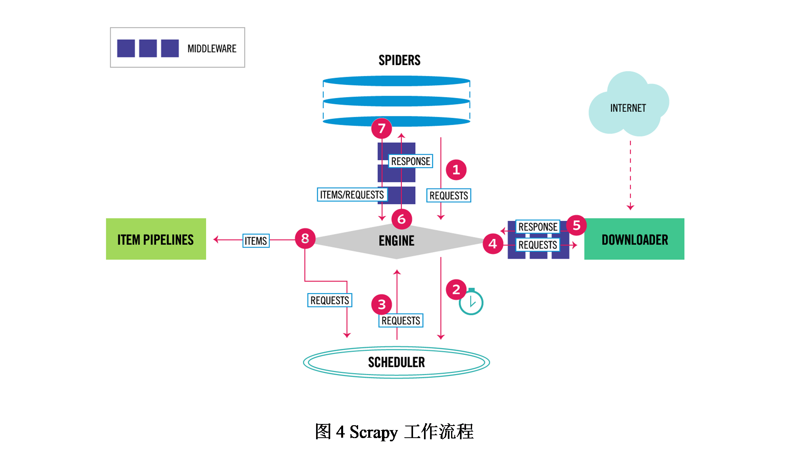

1. 爬虫引擎获得初始请求开始抓取。

2. 爬虫引擎开始请求调度程序，并准备对下一次的请求进行抓取。

3. 爬虫调度器返回下一个请求给爬虫引擎。

4. 引擎请求发送到下载器，通过下载中间件下载网络数据。

5. 一旦下载器完成页面下载，将下载结果返回给爬虫引擎。

6. 引擎将下载器的响应通过中间件返回给爬虫进行处理。

7. 爬虫处理响应，并通过中间件返回处理后的items，以及新的请求给引擎。

8. 引擎发送处理后的items到项目管道，然后把处理结果返回给调度器，调度器计划处理下一个请求抓取。

9. 重复该过程（继续步骤1），直到爬取完所有的url请求。

忽略引擎，Scrapy的爬取工作流程可简单的概括成Scrapy首先从入口URL（start_urls）开始，Scheduler 将其交给 Downloader 进行下载，下载之后交给 Spider 进行解析，Spider 解析出来的结果有两种：一种是需要进一步抓取的链接，例如“下一页”的链接，这些会被传回 Scheduler；另一种是需要保存的数据，它们则被送到 Item Pipeline，Item Pipeline 是对数据进行后期处理（详细分析、过滤、存储等）的组件。另外，在数据流动的通道里还可以安装各种中间件，进行必要的数据处理。

##### 4.2.1.2 具体实现

制作 Scrapy 爬虫一共需要4步：一是新建项目(scrapy startproject xxx)：新建一个新的爬虫项目（不加赘述）。二是明确目标（items.py）：明确想要抓取的目标，其负责声明结构化数据。三是制作爬虫（spiders/xxspider.py）：制作爬虫开始爬取网页即爬虫的配置。四是存储内容（pipelines.py）：设计管道存储爬取内容。以下将对这几方面的具体实现分别展开叙述。

明确目标（items.py）。对于马蜂窝上的游记，选取五项有效信息——目的地、标题、时间、作者、内容，作为爬取目标。

制作爬虫（spiders/mfw.py）。这一步是爬虫的关键——提取数据。Scrapy自带了提取数据的机制。它们称为选择器(seletors)[13]，因为它们“选择”由 XPath 或 CSS 表达式指定的 HTML 文档的某些部分。XPath 是用于选择 XML 文档中的节点的语言，其也可以与 HTML 一起使用。CSS 是一种用于将样式应用于HTML 文档的语言。它定义了选择器以将这些样式与特定的 HTML 元素相关联。通过分析马蜂窝游记网页的 HTML 源码，依靠元素的属性定位到需要递归抓取的网页链接以及需要提取的游记网页中的上述五项有效信息的位置。并据此编写返回内容。

存储内容（pipelines.py）。对于数据的处理，在 scrapy 中使用管道的方式进行，这里的处理包括数据的处理，过滤及保存。在本文的研究实现中其只用于保存数据。即注册一个 Pipeline 管道将上述目标数据结果保存到 JSON 文件中。

#### 4.2.2 数据的处理

##### 4.2.2.1 相关方法

###### 4.2.2.1.1 结巴（jieba）

“结巴”是一个中文分词组件。其支持三种分词模式：精确模式，试图将句子最精确地切开，适合文本分析；全模式，把句子中所有的可以成词的词语都扫描出来,速度非常快，但是不能解决歧义；搜索引擎模式，在精确模式的基础上，对长词再次切分，提高召回率，适合用于搜索引擎分词。三种模式各有利弊适用于不同的场合。“结巴”的算法主要是基于前缀词典实现高效的词图扫描，生成句子中汉字所有可能成词情况所构成的有向无环图，然后采用了动态规划查找最大概率路径,找出基于词频的最大切分组合。而对于未登录词，“结巴”采用了基于汉字成词能力的隐马尔可夫模型（HMM），使用了 Viterbi 算法。

###### 4.2.2.1.2 TF-IDF

TF-IDF 的全称是 term frequency–inverse document frequency。即 TF-IDF有两层意思，一层是"词频"（Term Frequency，缩写为TF），另一层是"逆文档频率"（Inverse Document Frequency，缩写为IDF）。它是一种用于信息检索与数据挖掘的常用加权技术，常用于挖掘文章中的关键词，而且算法简单高效，常被工业用于最开始的文本数据清洗。具体来说 TF-IDF 是一种统计方法，用以评估一字词对于一个文件集或一个语料库中的其中一份文件的重要程度。字词的重要性随着它在文件中出现的次数成正比增加，但同时会随着它在语料库中出现的频率成反比下降。也就是说上述引用总结就是, 一个词语在一篇文章中出现次数越多, 同时在所有文档中出现次数越少, 越能够代表该文章。

在一份给定的文件里，词频（term frequency，tf）指的是某一个给定的词语在该文件中出现的频率。这个数字是对词数（term count）的归一化，以防止它偏向长的文件。（同一个词语在长文件里可能会比短文件有更高的词数，而不管该词语重要与否。） TF 的计算公式：


但是，一些通用的词语对于主题并没有太大的作用，反倒是一些出现频率较少的词才能够表达文章的主题, 所以单纯使用 TF 是不合适的。权重的设计必须满足：一个词预测主题的能力越强，权重越大，反之，权重越小。所有统计的文章中，一些词只是在其中很少几篇文章中出现，那么这样的词对文章的主题的作用很大，这些词的权重应该设计的较大。IDF 就是在完成这样的工作[14]。

逆文档频率（inverse document frequency, IDF）的主要思想是：如果包含词条 w 的文档越少， IDF 越大，就是说词条 w 具有很好的类别区分能力。某一特定词语的 IDF，可以由总文件数目除以包含该词语的文件的数目，再将商取对数得到。IDF 的计算公式：


某一特定文件内的高词语频率乘以该词语在整个文件集合中的低文件频率，可以产生出高权重的 TF-IDF。因此，TF-IDF倾向于过滤掉常见的词语，保留重要的词语。TF-IDF的计算公式：


TF-IDF的优点是简单快速，而且容易理解。缺点是有时候用词频来衡量文章中的一个词的重要性不够全面，有时候重要的词出现的可能不够多，而且这种计算无法体现位置信息，无法体现词在上下文的重要性。

###### 4.2.2.1.3 余弦相似度

余弦相似度，又称为余弦相似性，是通过计算两个向量的夹角余弦值来评估他们的相似度。0度角的余弦值是1，而其他任何角度的余弦值都不大于1；并且其最小值是-1。从而两个向量之间的角度的余弦值确定两个向量是否大致指向相同的方向。两个向量有相同的指向时，余弦相似度的值为1；两个向量夹角为90°时，余弦相似度的值为0；两个向量指向完全相反的方向时，余弦相似度的值为-1。这结果是与向量的长度无关的，仅仅与向量的指向方向相关。余弦相似度通常用于正空间，因此给出的值为0到1之间。注意这上下界对任何维度的向量空间中都适用，而且余弦相似性最常用于高维正空间。例如在信息检索中，每个词项被赋予不同的维度，而一个文档由一个向量表示，其各个维度上的值对应于该词项在文档中出现的频率。余弦相似度因此可以给出两篇文档在其主题方面的相似度。另外，它通常用于文本挖掘中的文件比较。向量和向量 的余弦相似度计算公式：


#### 4.2.2.2 具体实现

对于爬到的 50 个城市的每个 75 篇游记的内容，将其从 json 提取到 txt，并且每个城市保存为一个 txt 文件。这就是每个城市的原始数据，之后是对原始数据的预处理部分。

对于原始数据来说，不能直接计算文本的相似度，一是数据量过大容易过拟合，二是这样计算出来的相似度过低社团检测效果不好。本文的研究采用以城市关键词的相似度作为城市之间相似度的度量方法。实际实现是对于每个城市的所有游记内容即 txt 文本使用 jieba（详见相关方法）进行分词处理，提取关键词。但是结巴分出的词这些词并不都是需要的。对于自然语言来说，有些单词使用十分广泛，甚至是过于频繁，类似于“我”，“就”之类的词几乎在每个文档上均会出现。这样的词对于文本的特征来说没有什么作用。还有些词在文本中出现也频率很高，但实际意义又不大比如语气助词、副词、介词、连词等。通常自身并无明确意义，只有将其放入一个完整的句子中才有一定作用的词语。如常见的“的”、“在”、“和”、“接着”之类。上述两种词被称为停用词。停用词对于描述城市是无用的甚至会影响结果，所以直接将其去掉。实际实现是在分词完成后加载停用词表（获取方式稍后叙述）去除停用词。我将上述分词及去停用词的处理操作称为清洗（下文均以此名称叙述）。在城市的游记内容全部清洗完成后以城市为单位记录清洗后的分词结果。

对于城市社团检测来说，并不是清洗出的每个词的重要性都完全相同，也就是说有些词是城市的关键词而有些词可有可无。本文的研究使用 TF-IDF（详见相关方法）为清洗后的词语加权，将文本特征量化，挖掘其中的关键词。对计算完成的 TF-IDF 矩阵归一化，然后查找并删除只被一个城市拥有的属性，即删除只有一个城市的 TF-IDF 值不为 0 的属性，然后人工的手动筛选所有剩余属性中的停用词，将筛选出的停用词做成停用词表，并以此停用词表重新清洗游记文本，并重新计算 TF-IDF 矩阵。

根据 TF-IDF 矩阵把每个城市表示为一个向量，以余弦相似度（详见相关方法）作为城市游记文本相似度度量标准，计算相似矩阵。这样计算出来的相似矩阵的每个相似度值一定在 0 到 1 之间，因为 TF-IDF 权值不能为负数。另因为是大数据，所以每两个城市向量或多或少都会有一些相似性，这就导致几乎每个城市都会和其他城市相连接，因此本文的研究使用阈值去除掉一些相似度较小的边。而阈值的选取由人工多次实验观察社团检测效果得到。一般来说，相似度越大说明城市之间的距离越小，本文的研究把一减相似度作为距离得到距离矩阵，并以此建立城市关系网络。对城市网络使用 Grivan Newman 算法进行社团检测，并对结果进行可视化分析。

## 第5章 可视化分析

### 5.1 基于风景图片的社团检测

基于谷歌城市风景图片的社团检测结果如下所示。由上文 GN 算法原理可知，GN 算法可将网络分成小于城市数目的任意多类，经分析在聚成七类时，社团检测效果较好，既没有孤立数据点，也不至于无法分辨城市类别。故以下均以此结果进行分析。

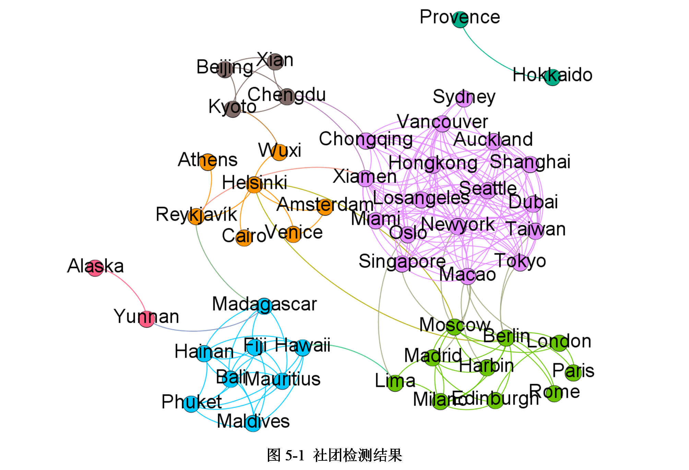

接下来本文将结合语义信息对社团检测的结果按照繁荣、发达程度，标志性建筑，地理位置，风景，文化等角度进行分析。

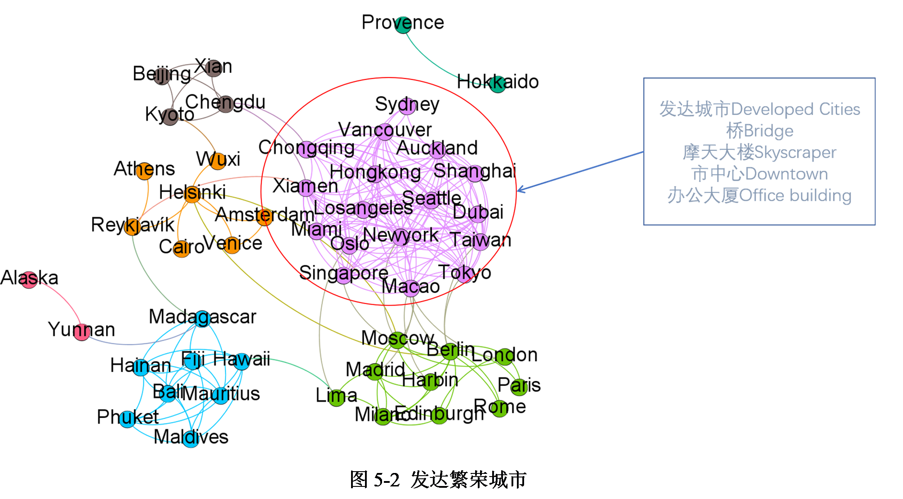

观察社团检测结果可以发现，图 5-2 中被圈出的粉色社团可以找到这些城市之间相同的关键字属性——发达城市、桥、摩天大楼、市中心、办公大厦等。这些城市大多都是寸土寸金，高楼林立，他们普遍建筑物现代化，经济发达，生活水平高，并且其中大多数都是不夜城。他们的图片基本都和下图的迪拜和香港类似。


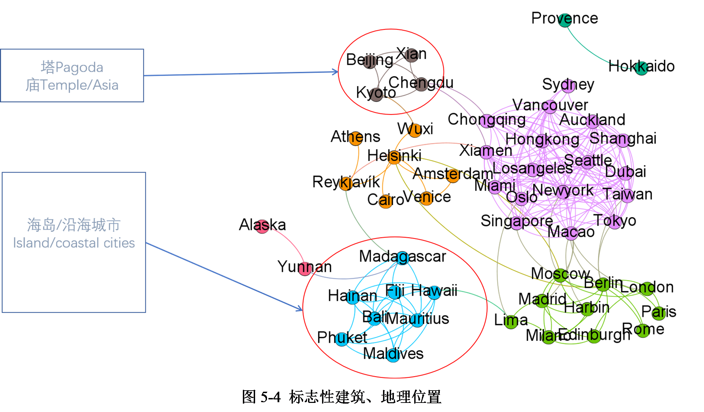

如图 5-4，其中被圈出的较小的棕色社团，他们都有一些标志性的建筑物：塔，庙等。


这四个城市的图片基本和图 5-5 的北京和京都类似。究其原因，首先他们都是亚洲城市，中国的三个城市都有比较久远的历史，传承时间较长，且这些古建筑保存较好。对于日本的京都来说，是因为日本的建筑风格早期受中国影响较深，而京都仍保留着这些较古老的建筑。

另一方面，从社区结果来看，图 5-4 中被圈出的较大的蓝色社团中都是一些沿海城市，他们或是在内陆的沿海港口城市，或是海岛城市。其特色比较鲜明如下图 5-6 马尔代夫和斐济所示。


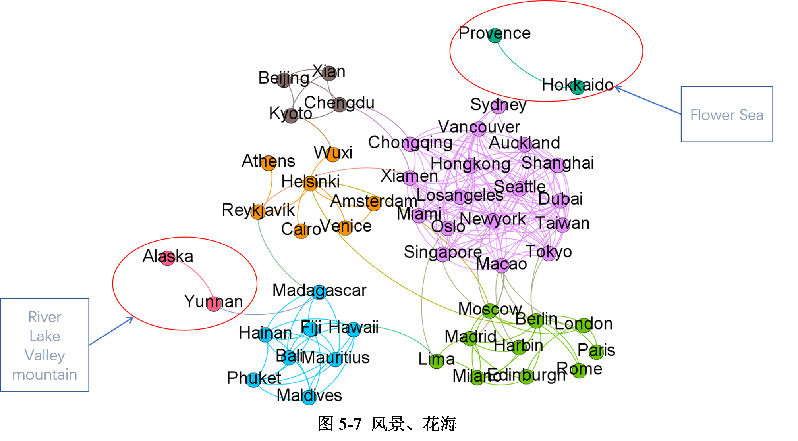

对于阿拉斯加和云南，普罗旺斯和北海道，社团检测之前是没想过他们会被聚在一起的，是意料之外的发现。

阿拉斯加和云南被聚在一起是因为，他们都有一些比如河、湖、山谷、大山这些自然风光。这两个城市的图片大多是这种自然不着人工的景色，他们在纯天然的风景上确实比较相似。如下图 5-8 所示云南和阿拉斯加风光。


而普罗旺斯和北海道是最让人意想不到的两座城市，经查看城市字典发现，他们被聚在一起是因为，他们都有花海这一景色，并且都非常的出名。如下图 5-9 所示普罗旺斯的薰衣草和北海道的紫丁香。


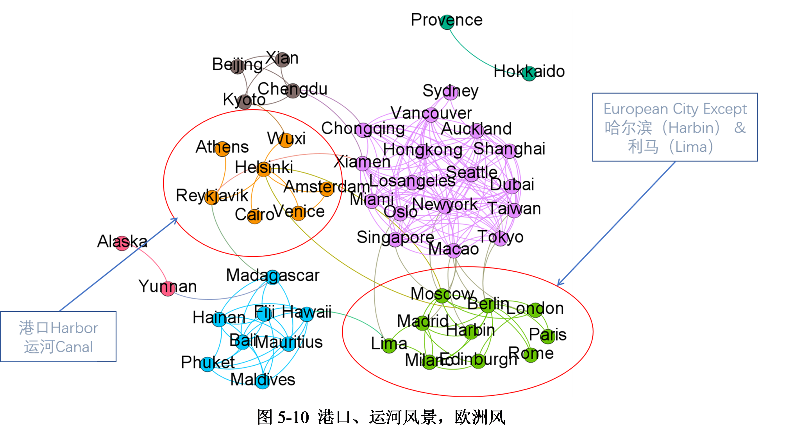

图 5-10 中左侧的橙色社团中的城市多是一些水乡，他们不乏运河，港口这样的关键字，就如下图 5-11 的赫尔辛基和威尼斯所示。


而图 5-10 中右侧的绿色社团中的城市基本都是欧洲城市。值得注意的是哈尔滨和利马。他们虽不是欧洲城市，但是其建筑多是欧洲风格。对于哈尔滨，其与俄罗斯接壤，历史上曾有大量俄国侨民来到哈尔滨定居。而哈尔滨也被称为“东方莫斯科”。下图 5-12 即为哈尔滨和莫斯科建筑。

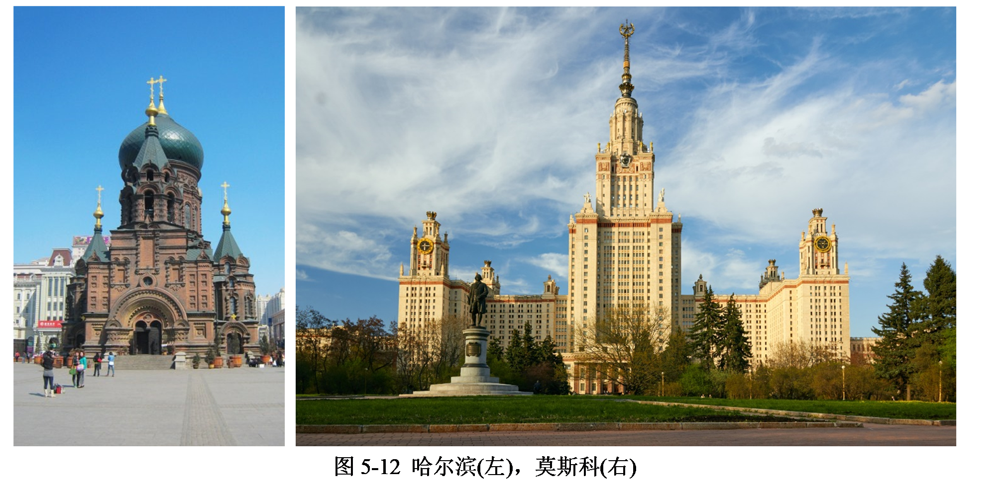

利马虽不与欧州接壤，但利马在历史上曾长时间被西班牙殖民统治。1532
年，弗朗西斯科·皮萨罗带领的征服者击败印加帝国皇帝阿塔瓦尔帕，西班牙自此开始对利马的统治。西班牙人不仅摧毁了所有的印加文化，并且将西班牙文化带到当地取而代之。这也就使得利马的建筑风格以欧洲风居多。下图 5-13 展示了利马和柏林的建筑。


### 5.2 基于游记文本的社团检测

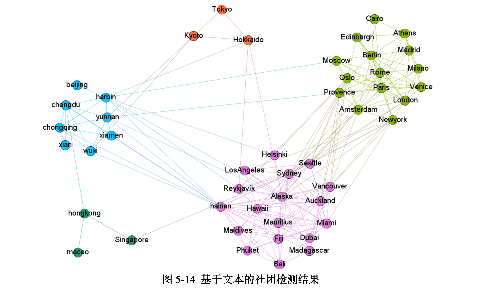

基于马蜂窝游记文本的社团检测结果如上所示。经分析在聚成五类时，社团检测效果较好，既没有孤立数据点，也不至于无法分辨城市类别。故以下均以此结果分析。

需要说明的是这一社团结果中只包含 47 个城市，缺失的三个城市分别是利马，上海以及台湾。他们没有出现在社团检测中是因为他们和每一个城市的相似度都不高，导致在阈值筛选的时候，将与他们有关的边都删掉了。所以他们不会出现在网络，社团检测结果中自然也就没有他们了。而如果降低阈值强行将他们加入网络则会造成网络过于复杂，使得社团检测效果变差，并且即使将他们加入网络也会因为他们和其他城市的相似度过低导致其率先被分离成孤立数据点失去社团检测分析的意义。故而本文研究只呈现 47 座城市的社团检测结果。

对于造成这种情况的原因，经分析大致有以下三点：

一是上海和台湾本身特色过于鲜明，导致他们和哪一座城市都不太相似。下图展示了两座城市的词云。可以看出这两座城市与众不同的关键词较多，并且他们的权值较大。


二是利马的数据量不够大，马蜂窝上关于利马的游记只有 75 篇，但由于 Scrapy 的异步性，使得最后只获得了 44 篇游记内容。数据量小使得利马的关键词不多，并且由于较少的数据量其关键词也不会很突出，这导致了利马和所有城市的相似度是最低的。

三可能是停止词的问题，由于中文的博大精深，而学生功底有限，并且中文停用词库缺乏，需要人工的筛选停用词以获得更好的效果，在面对大量属性数据时难免会筛选失误，并且由于是大数据这种错误很难查明。这可能就使得某些需要的关键字被移除，导致多座城市之间的相似度降低。

接下来本文将对社团检测的结果按照生活节奏，文化，地理位置等进行分析。

观察社团检测结果可以发现，下图中被圈出的粉色和绿色社团可以按照生活节奏简单的分成繁忙都市（快节奏）和度假城市（慢节奏）。并且这两个社团包括的城市都比较多，加起来几乎囊括了的城市。因为节奏，人们在繁忙的城市和度假城市之间有完全不同的感觉，即使这之中不乏一些有相似的建筑风格或气候城市。由此可见城市节奏完全可以影响人们对一个城市的评价。

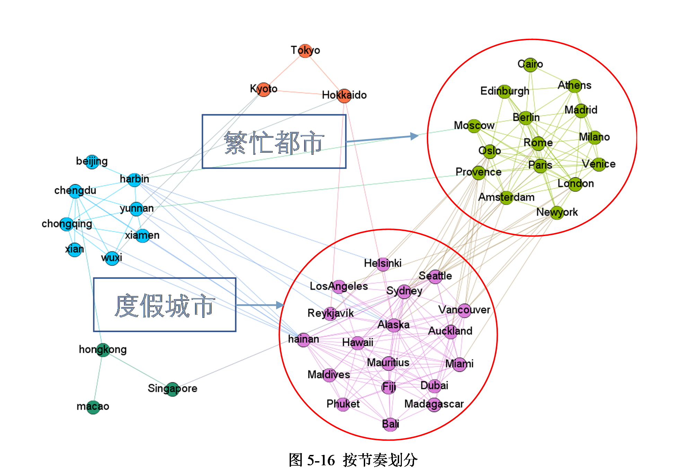

另一方面，不同的文化也会影响对城市的评价。从社区结果来看，人们倾向于将全球城市分为中国城市和外国城市。而这表明了文化因素可能比其他因素更能给游客留下深刻的印象。值得注意的是在外国城市中，日本可能由于选材较多，它的三个城市被聚到了一起。另海南虽然是中国的城市，但是可能相较于文化来说，节奏更能在直观地，简单地，粗暴地在游客的脑海里留下更深刻的印象。或者说这是第一印象，使得海南和度假城市的相性更好一些。

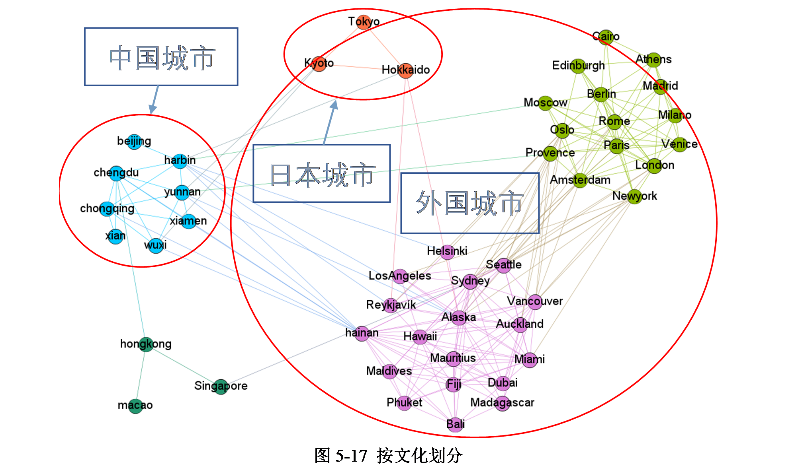

对于地理位置也是非常能人们关注的因素。图 9 中圈出的蓝色社团可以看作内陆城市，而深绿色社团是沿海城市。值得注意的是厦门虽是沿海城市却被分到内陆中，经分析可以得出以下几点原因：一、相较于地理位置，文化上的感受可能更深一些，厦门从未被殖民过，而新加坡、香港、澳门都曾被其他国家统治过，其中香港和新加坡都曾被英国统治。二、制度差异，厦门属于社会主义制度，而香港、澳门、新加坡均实行资本主义制度，两种制度所造成的差异感，以及可能先入为主的认为两种制度的不同导致表达内容的千差万别。三、厦门经济虽然发达，但远不及香港、澳门、新加坡。在这些地方游玩的有课对其发达程度相较于地理位置的感受可能更能留下记忆。

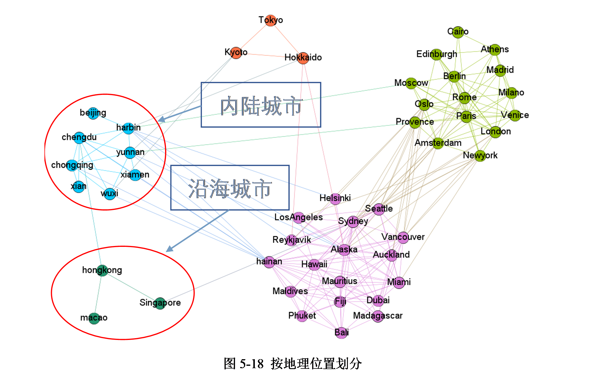

## 第6章 结论与展望

### 6.1 结论

本文的研究通过比较城市之间的相似性来发现城市社区，然后借由进一步的分析去发现城市之间的关系。通过对最终结果的分析，可以发现在图片的视角下，基于客观存在的特征(如建筑类型、地形等特征)对城市进行社团检测。不存在过多的主观因素，更能体现城市在轮廓，风景，外观上的相似度。即使是一个国家，有相似的文化特征，人们对城市的感觉何其相似，但由于图片的客观性如：建筑风格，地理位置等的不同，他们仍会被分成不同的社团。但若其风景相似，即使相距万里，他们也将成为一个社团的成员。对比游记文本，可以发现主观感受的确会影响对城市的评价，尤其是在城市节奏方面。即使城市之间的建筑风格，气候，文化，社会制度，地理位置千差万别，但是因为游客对城市节奏感知的深刻，他们仍可能会被归为一个社团。另一方面，不同的文化也会影响对城市的评价。从社区结果来看，人们倾向于将全球城市分为中国城市和外国城市。这表明文化因素可能比其他因素更能给游客留下深刻的印象。

因此，基于本文的社团检测结果，可以利用其作为一个推荐工具，根据游客自己的兴趣，告诉他们接下来要去哪个城市。比如说某人喜欢某一个城市，但是去这个城市的成本过高或者有其它原因无法到达，那么可以基于社团检测的结果，推荐给他一些和这个城市处在同一社团的相似城市，并可以按相似度进行一个排序供其选择。或者说某一个人喜欢拥有某些属性的城市，那么可以根据城市字典，将符合这些条件的城市社团推荐给他。这样游客根据自己的兴趣，可以有效的缩小目的地范围甚至锁定想要去的目标城市。

综上所述，本文的研究可以发现世界各地城市之间存在着内在联系，并且可以明显感受到在评价事物时主观感受的强大力量。


### 6.2 不足之处及未来展望

本文的研究以城市风景图片和马蜂窝游记作为原始数据进行分析，包含了主观和客观两方面因素，考虑到了游客在选择目的地时所关心的这些城市的风景、建筑风格、自然风光这类的客观条件，以及社会人文，特产小吃、游玩乐园等比较主观的因素。但由于时间、设备性能以及其它因素限制没有使用到非常大量的数据，结果有一定的局限性。处理图片数据提取语义信息时，使用的模型Place365只有365个场景，难以得到一些比较有标志性的特色。处理游记文本时，由于中文的博大精深，本文使用的手法略显稚嫩，使得处理出的数据可能会带有一些噪声或丢失一些信息。

进一步的研究可能会改变图片处理的方法，改进文本的清洗方式。将主客观进行更加深入的对比、整合，而这也许能发现一些意想不到的有效结论。并在此基础上将社团检测结果制作成一个实时更新的完整的推荐系统。


## 参考文献
[1] 罗珊珊，《出游热情高 消费动力足》，人民日报，2019-05-20（10）.

[2] Images.google.com (2019). Google Images. [online] Available at: https://images.google.com/

[3] Mafengwo.cn. (2019). 旅游攻略,自由行,自助游攻略,旅游社交分享网站 - 马蜂窝. [online] Available at: http://www.mafengwo.cn/ [Accessed 7 Jun. 2019].

[4] Girvan M, Newman M E J. Community structure in social and biological networks[J]. Proceedings of the national academy of sciences, 2002, 99(12): 7821-7826.

[5] Newman M E, Girvan M. Finding and evaluating community structure in networks.[J]. Physical Review E Statistical Nonlinear & Soft Matter Physics, 2004, 69(2):026113.

[6] M. E. J. Newman. Finding community structure in networks using the eigenvectors of ma-trices [J]. Phys. Rev. E, 74(3):036104, September 2006.

[7] Yang J, Mcauley J, Leskovec J. Community Detection in Networks with Node Attributes[J]. 2014:1151-1156.

[8] M. S. Granovetter. The Strength of Weak Ties. The American Journal of Sociology, 78:1360–1380, 1973.

[9] Albert-László Barabási, Network Science, Cambs:Cambridge University Press, 2016:Chapter 9 Section 9.7.

[10]    Hardik, Vasa. (2019). Google Images Download. Retrieved from https://github.com/hardikvasa/google-images-download.

[11]    Places: A 10 million Image Database for Scene Recognition B. Zhou, A. Lapedriza, A. Khosla, A. Oliva, and A. Torralba IEEE Transactions on Pattern Analysis and Machine Intelligence, 2017

[12]    Anubhav, P. (2018). Scrapy Architecture overview. Retrieved from https://doc.scrapy.org/en/master/topics/architecture.html.

[13]    Scrapy.readthedocs.io. (2019). Selectors — Scrapy 1.6.0 documentation. [online] Available at: https://scrapy.readthedocs.io/en/latest/topics/selectors.html [Accessed 7 Jun. 2019].

[14]    Miracle, JQ. (2018). NLP基本方法：TF-IDF原理及应用. Retrieved from https://www.jianshu.com/p/3113e06841f6.
